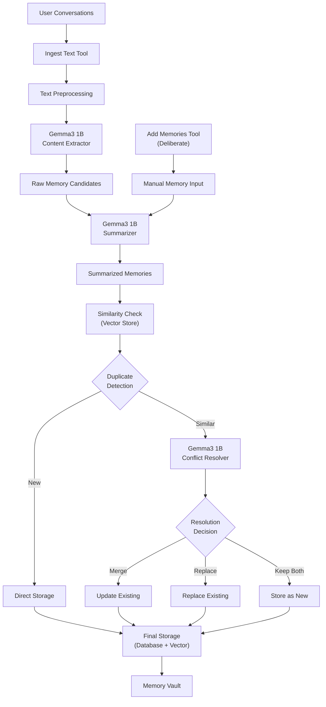

# Robust Memory Ingestion Pipeline Architecture

**Document Version:** 1.0  
**Created:** 2024  
**Status:** Planning Phase  

## Overview

This document outlines the design and implementation plan for a robust memory ingestion pipeline for the Mimir AI Memory Vault. The pipeline is designed to intelligently process user conversations and extract high-quality, relevant memories while handling deduplication and conflict resolution through integration with Gemma3 1B lightweight LLM.

## Architecture Diagram



## Implementation TODO List

### Task Breakdown

| Task ID | Description | Status | Dependencies |
|---------|-------------|--------|--------------|
| `gemma3-integration` | Integrate Gemma3 1B model for LLM operations (extraction, summarization, conflict resolution) | ⏳ Pending | None |
| `text-preprocessor` | Implement text preprocessing module for conversation parsing and cleaning | ⏳ Pending | None |
| `memory-extractor` | Create memory extraction service using Gemma3 to identify worthwhile memories from conversations | ⏳ Pending | `gemma3-integration`, `text-preprocessor` |
| `memory-summarizer` | Implement memory summarization service to condense content and reduce token size | ⏳ Pending | `gemma3-integration` |
| `similarity-checker` | Build similarity detection system using vector embeddings to identify potential duplicates | ⏳ Pending | None |
| `conflict-resolver` | Create conflict resolution service using Gemma3 to decide merge/replace/keep strategies | ⏳ Pending | `gemma3-integration`, `similarity-checker` |
| `ingest-text-tool` | Implement ingest_text MCP tool for bulk conversation processing | ⏳ Pending | `memory-extractor`, `memory-summarizer`, `conflict-resolver` |
| `enhanced-add-memories` | Enhance existing add_memory tool to use new pipeline components | ⏳ Pending | `memory-summarizer`, `conflict-resolver` |
| `pipeline-orchestrator` | Create main pipeline orchestrator to coordinate all ingestion steps | ⏳ Pending | `ingest-text-tool`, `enhanced-add-memories` |
| `pipeline-testing` | Implement comprehensive testing for the ingestion pipeline components | ⏳ Pending | `pipeline-orchestrator` |

## Core Architecture Components

### 1. Text Preprocessing Module

**Location:** `crates/mimir-ingestion/src/preprocessor.rs`

```rust
pub struct TextPreprocessor {
    // Conversation parsing
    // PII detection and masking
    // Content segmentation
    // Turn separation
}
```

**Features:**
- **Conversation Parsing**: Extract individual messages, timestamps, participants
- **Content Cleaning**: Remove formatting artifacts, normalize text
- **Turn Segmentation**: Split conversations into logical segments for processing
- **PII Protection**: Integrate with existing `mimir-guardrails` for sensitive data detection

### 2. Gemma3 1B Integration Layer

**Location:** `crates/mimir-llm/src/gemma.rs`

```rust
pub struct GemmaService {
    model: GemmaModel,
    config: GemmaConfig,
}

pub enum GemmaTask {
    Extract,      // Extract memorable content
    Summarize,    // Condense memories
    Resolve,      // Handle conflicts
    Classify,     // Categorize memories
}
```

**Implementation Strategy:**
- **Model Loading**: Use `candle-core` or `llama-cpp-rs` for efficient inference
- **Task-Specific Prompts**: Templated prompts for each pipeline stage
- **Batch Processing**: Process multiple items efficiently
- **Token Management**: Optimize for Gemma3's context window

### 3. Memory Extraction Service

**Location:** `crates/mimir-ingestion/src/extractor.rs`

```rust
pub struct MemoryExtractor {
    llm_service: GemmaService,
    quality_thresholds: ExtractionConfig,
}

pub struct MemoryCandidate {
    content: String,
    confidence: f32,
    suggested_class: MemoryClass,
    context_window: String,
    extracted_tags: Vec<String>,
}
```

**Extraction Logic:**
- **Relevance Scoring**: Use Gemma3 to score content memorability (0.0-1.0)
- **Context Preservation**: Maintain conversation context for extracted memories
- **Smart Segmentation**: Identify coherent memory units across multiple messages
- **Auto-Classification**: Suggest appropriate `MemoryClass` (Personal, Work, etc.)

### 4. Memory Summarization Service

**Location:** `crates/mimir-ingestion/src/summarizer.rs`

```rust
pub struct MemorySummarizer {
    llm_service: GemmaService,
    target_token_limit: usize,
    preservation_strategy: PreservationStrategy,
}

pub enum PreservationStrategy {
    FactualPrecision,  // Preserve key facts
    ContextualRichness, // Maintain context
    ActionableItems,   // Focus on actionable content
}
```

**Summarization Features:**
- **Token Optimization**: Target specific token limits (e.g., 150-300 tokens)
- **Key Information Preservation**: Ensure critical details aren't lost
- **Semantic Coherence**: Maintain meaning while reducing length
- **Style Consistency**: Normalize writing style across memories

### 5. Similarity Detection & Deduplication

**Location:** `crates/mimir-ingestion/src/similarity.rs`

```rust
pub struct SimilarityDetector {
    vector_store: Arc<ThreadSafeVectorStore>,
    similarity_threshold: f32,
    semantic_analyzer: SemanticAnalyzer,
}

pub struct DuplicateCandidate {
    existing_memory: Memory,
    similarity_score: f32,
    semantic_overlap: f32,
    recommended_action: ConflictAction,
}
```

**Detection Strategy:**
- **Vector Similarity**: Use existing BGE embeddings for semantic comparison
- **Threshold Configuration**: Configurable similarity thresholds (0.85+ for high confidence)
- **Temporal Analysis**: Consider time proximity for duplicate detection
- **Content Analysis**: Distinguish between updates vs. true duplicates

### 6. Conflict Resolution Engine

**Location:** `crates/mimir-ingestion/src/resolver.rs`

```rust
pub struct ConflictResolver {
    llm_service: GemmaService,
    resolution_strategies: ResolutionConfig,
}

pub enum ConflictAction {
    Merge(MergeStrategy),
    Replace { reason: String },
    KeepBoth { differentiation: String },
    Discard { reason: String },
}

pub enum MergeStrategy {
    Concatenate,
    LLMSynthesis,
    FactualUpdate,
    ContextualEnrichment,
}
```

**Resolution Logic:**
- **LLM-Guided Decisions**: Use Gemma3 to analyze conflicts and suggest actions
- **Factual Consistency**: Detect contradictory information
- **Temporal Reasoning**: Prefer newer information when appropriate
- **User Intent Preservation**: Maintain original intent while resolving conflicts

## Enhanced MCP Tools

### 1. `ingest_text` Tool

```rust
#[derive(Debug, schemars::JsonSchema, serde::Deserialize, serde::Serialize)]
struct IngestTextParams {
    /// Raw conversation text or structured messages
    content: ConversationContent,
    /// Source identifier (user, session, etc.)
    source: String,
    /// Session ID for grouping related memories
    session_id: String,
    /// Processing configuration
    config: Option<IngestionConfig>,
}

#[derive(Debug, serde::Deserialize, serde::Serialize)]
pub enum ConversationContent {
    RawText(String),
    StructuredMessages(Vec<Message>),
    ChatLog { format: String, data: String },
}

#[derive(Debug, serde::Deserialize, serde::Serialize)]
pub struct IngestionConfig {
    /// Minimum confidence for memory extraction
    extraction_threshold: f32,
    /// Target summarization length
    max_summary_tokens: usize,
    /// Similarity threshold for duplicate detection
    similarity_threshold: f32,
    /// Enable automatic conflict resolution
    auto_resolve_conflicts: bool,
}
```

### 2. Enhanced `add_memories` Tool

```rust
#[derive(Debug, schemars::JsonSchema, serde::Deserialize, serde::Serialize)]
struct AddMemoriesParams {
    /// Array of memories to add
    memories: Vec<RawMemoryInput>,
    /// Source identifier
    source: String,
    /// Session ID
    session_id: String,
    /// Whether to apply summarization
    auto_summarize: bool,
    /// Whether to check for conflicts
    check_conflicts: bool,
}

#[derive(Debug, serde::Deserialize, serde::Serialize)]
pub struct RawMemoryInput {
    content: String,
    suggested_class: Option<MemoryClass>,
    tags: Vec<String>,
    context: Option<String>,
}
```

## Pipeline Orchestration

### Main Ingestion Pipeline

**Location:** `crates/mimir-ingestion/src/pipeline.rs`

```rust
pub struct IngestionPipeline {
    preprocessor: TextPreprocessor,
    extractor: MemoryExtractor,
    summarizer: MemorySummarizer,
    similarity_detector: SimilarityDetector,
    conflict_resolver: ConflictResolver,
    storage: Arc<IntegratedStorage>,
}

impl IngestionPipeline {
    pub async fn process_conversation(
        &self,
        content: ConversationContent,
        config: IngestionConfig,
    ) -> Result<IngestionResult> {
        // 1. Preprocess text
        let segments = self.preprocessor.parse_conversation(content).await?;
        
        // 2. Extract memory candidates
        let candidates = self.extractor.extract_memories(segments, &config).await?;
        
        // 3. Summarize candidates
        let summarized = self.summarizer.summarize_batch(candidates, &config).await?;
        
        // 4. Check for similarities
        let conflicts = self.similarity_detector.find_duplicates(&summarized).await?;
        
        // 5. Resolve conflicts
        let resolved = self.conflict_resolver.resolve_conflicts(conflicts, &config).await?;
        
        // 6. Store final memories
        let stored = self.storage.add_memories(resolved).await?;
        
        Ok(IngestionResult { stored, statistics: /* ... */ })
    }
}
```

## Configuration & Monitoring

### Pipeline Configuration

**Location:** `crates/mimir-core/src/config.rs` (extend existing config)

```rust
#[derive(Debug, Clone, Serialize, Deserialize)]
pub struct IngestionConfig {
    /// Gemma3 model configuration
    pub gemma_config: GemmaConfig,
    
    /// Extraction thresholds
    pub extraction: ExtractionConfig,
    
    /// Summarization settings
    pub summarization: SummarizationConfig,
    
    /// Conflict resolution settings
    pub conflict_resolution: ConflictConfig,
    
    /// Performance settings
    pub performance: PerformanceConfig,
}
```

### Monitoring & Analytics

```rust
pub struct IngestionMetrics {
    pub processed_conversations: usize,
    pub extracted_memories: usize,
    pub conflicts_resolved: usize,
    pub processing_time: Duration,
    pub token_usage: TokenUsage,
    pub quality_scores: QualityMetrics,
}
```

## Integration Points

### 1. Extend Existing Storage
- Enhance `IntegratedStorage` to support batch operations
- Add conflict resolution metadata to memory records
- Implement similarity caching for performance

### 2. Leverage Existing Systems
- **Vector Store**: Use existing BGE embeddings for similarity detection
- **Encryption**: Apply existing class-based encryption to new memories
- **Guardrails**: Integrate PII detection into preprocessing

### 3. New Crate Structure
```
crates/
├── mimir-ingestion/     # New: Main ingestion pipeline
├── mimir-llm/          # New: Gemma3 integration
├── mimir-nlp/          # New: Text processing utilities
├── mimir/              # Enhanced: Add new MCP tools
├── mimir-core/         # Enhanced: Extend config & types
└── mimir-vector/       # Enhanced: Batch similarity operations
```

## Implementation Phases

### Phase 1: Foundation (2-3 weeks)
**Objectives:**
- Gemma3 integration layer
- Basic text preprocessing
- Enhanced storage operations

**Deliverables:**
- `mimir-llm` crate with Gemma3 integration
- Basic `TextPreprocessor` implementation
- Enhanced batch operations in `IntegratedStorage`

### Phase 2: Core Pipeline (3-4 weeks)
**Objectives:**
- Memory extraction service
- Summarization engine
- Similarity detection

**Deliverables:**
- `MemoryExtractor` with quality scoring
- `MemorySummarizer` with configurable strategies
- `SimilarityDetector` with duplicate identification

### Phase 3: Intelligence (2-3 weeks)
**Objectives:**
- Conflict resolution
- Quality scoring
- Performance optimization

**Deliverables:**
- `ConflictResolver` with LLM-guided decisions
- Quality metrics and scoring systems
- Performance optimizations and caching

### Phase 4: Integration (1-2 weeks)
**Objectives:**
- MCP tool implementation
- Pipeline orchestration
- Testing & validation

**Deliverables:**
- `ingest_text` and enhanced `add_memories` MCP tools
- Complete `IngestionPipeline` orchestrator
- Comprehensive test suite and validation framework

## Technical Considerations

### Performance Requirements
- **Throughput**: Process 1000+ messages per minute
- **Latency**: < 2 seconds per memory extraction
- **Memory Usage**: < 1GB for typical workloads
- **Token Efficiency**: Optimize Gemma3 inference costs

### Quality Metrics
- **Extraction Accuracy**: > 85% relevant memories identified
- **Summarization Quality**: Preserve key information with 60% token reduction
- **Conflict Resolution**: > 90% automatic resolution success rate
- **Duplicate Detection**: < 5% false positive rate

### Security & Privacy
- **Data Protection**: All processing respects existing encryption boundaries
- **PII Handling**: Integrate with guardrails for sensitive data detection
- **Local Processing**: Gemma3 runs locally to maintain privacy-first principles
- **Audit Logging**: Track all pipeline decisions for transparency

## Future Enhancements

### Short-term (3-6 months)
- **Multi-language Support**: Extend to non-English conversations
- **Custom Extraction Rules**: User-defined memory extraction patterns
- **Advanced Conflict Resolution**: More sophisticated merge strategies

### Long-term (6-12 months)
- **Federated Learning**: Improve extraction quality across users
- **Advanced NLP**: Named entity recognition and relationship extraction
- **Memory Networks**: Build connections between related memories

## Conclusion

This robust memory ingestion pipeline provides a comprehensive solution for intelligent memory management in Mimir. By leveraging Gemma3 1B for extraction, summarization, and conflict resolution, combined with the existing vector similarity capabilities, the system will deliver high-quality, deduplicated memories while maintaining the privacy-first principles of the Mimir architecture.

The phased implementation approach ensures manageable development cycles while building towards a sophisticated memory ingestion system that can handle the complexities of real-world conversation processing. 